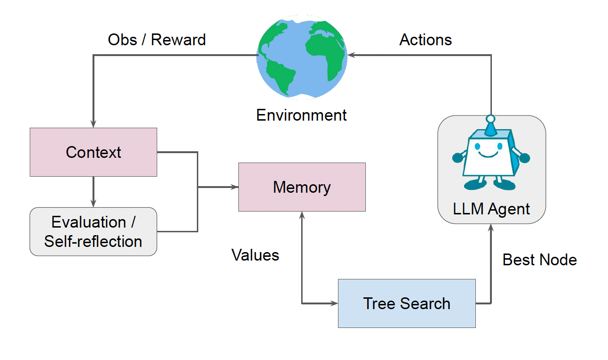

# Official Repo of Language Agent Tree Search (LATS) - ICML 2024

<p>
    <a href="https://www.python.org/">
        
    </a>
    <a href="https://copyright.illinois.edu/">
        
    </a>
</p>




### Reasoning + Acting (HotPotQA)

#### Setup

To get started:

1. Clone this repo
```bash
git clone -b master https://github.com/956961/TreeSearch && cd LanguageAgentTreeSearch/hotpot
```

2. Install the module dependencies into your environment:
```bash
pip install -r requirements.txt
```

3. Set the scripts and run paper experiments
```bash
sh lats.sh
```

- ``--n_generate_sample``: number of times to prompt during expansion/sampling
- ``--n_evaluate_sample``: number of times to prompt for state evaluation
- ``--iterations``: maximum number of trajectories to sample


## Trajectories
``programming/root/`` contains all the trajectories from the paper's experiments on programming. Please use get_acc.py with the log path to get the actual accuracy. HotPotQA and WebShop logs were too large to upload, feel free to email if interested.

